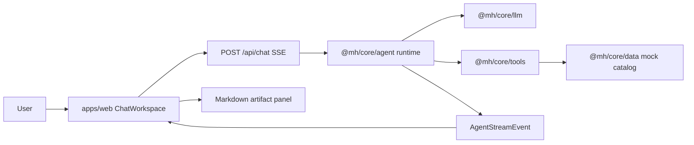

# LocalActivity Meituan Agent

一个本地短时活动规划 Agent 原型：用户用自然语言描述下午安排，系统通过 ReAct 工具调用查询 mock 画像、活动、餐厅、可用性和路程，生成可确认的 Markdown 方案文档，并在用户确认后执行预约/订位/发消息的 mock actions。

当前产品目标不是通用聊天，而是一个 本地生活工作区：

- 聊天主线展示可读进展。
- 工具调用折叠成步骤链路。
- 最终方案以 Markdown artifact 展示在右侧产物面板。
- 结构化 `plan.updated` 和 `confirmation.required` 继续作为执行确认的数据源。

## Quick Start

```bash
pnpm install
pnpm dev
```

默认会启动 `apps/web` 的 Next.js 开发服务。常用命令：

```bash
pnpm test
pnpm typecheck
pnpm check
pnpm build
```

## Environment

默认可以用 fake provider 跑完整 mock 流程：

```bash
LLM_PROVIDER=fake
```

真实模型相关环境变量在 `@mh/core/llm` 中读取：

```bash
LLM_PROVIDER=deepseek
DEEPSEEK_API_KEY=...
DEEPSEEK_BASE_URL=https://api.deepseek.com
DEEPSEEK_MODEL=deepseek-v4-pro
DEEPSEEK_THINKING=disabled
DEEPSEEK_REASONING_EFFORT=max
```

也保留了 MiniMax 配置：

```bash
LLM_PROVIDER=minimax
MINIMAX_API_KEY=...
MINIMAX_BASE_URL=https://api.minimaxi.com/v1
MINIMAX_MODEL=MiniMax-M2.7
```

## Repository Layout

```txt
apps/
  web/                     Next.js app, chat workspace UI, SSE API routes
packages/
  core/
    src/agent/             Runtime, stream orchestration, ReAct loop, artifacts
    src/llm/               Fake / DeepSeek / MiniMax client abstraction
    src/tools/             Tool registry and mock local-life tools
    src/data/              Mock activities, restaurants, products, user profile
    src/shared/            Zod schemas and event contracts
docs/
  architecture.md          System diagrams, stream flow, extension points
openspec/
  changes/                 Active OpenSpec change specs and tasks
```

The old package split (`agent`, `llm`, `tools`, `data`, `shared`) has been consolidated into `packages/core` with subpath exports:

```ts
import { createLocalActivityRuntime } from "@mh/core/agent";
import { AgentStreamEventSchema } from "@mh/core/shared";
```

## Runtime Flow



Important stream events:

- `thread.created`
- `agent.step`
- `tool.started`
- `tool.finished`
- `plan.updated`
- `artifact.updated`
- `confirmation.required`
- `execution.receipt`
- `run.completed`
- `run.failed`

Normal planning order:

```txt
plan.updated -> artifact.updated -> confirmation.required -> run.completed
```

Confirmed execution order:

```txt
execution.receipt* -> artifact.updated(final) -> run.completed(DONE)
```

## Artifact Model

The UI is optimized around a DeerFlow-like artifact workspace. In v1 artifacts are inline SSE payloads, not files:

```ts
type AgentArtifact = {
  id: string;
  kind: "markdown";
  title: string;
  content: string;
  status: "draft" | "final";
  sourcePlanId?: string;
  updatedAt: string;
};
```

The Markdown document is generated deterministically from the structured `Plan`, tool diagnostics, and receipts. It is not a second LLM generation step, so JSON/schema failures do not block the final user-facing document.

## Agent Design

The agent keeps a ReAct loop, but runtime guardrails force convergence:

- Duplicate tool calls are fingerprinted by `toolName + stable JSON input` and skipped.
- Single tool call count is capped per run.
- If the model keeps repairing or calling tools after enough facts exist, the runtime synthesizes a normal plan from successful traces.
- Loop-limit fallback still exists, but it is reserved for genuinely partial facts.
- Execution tools are blocked during planning and only run after confirmation.

See [docs/architecture.md](docs/architecture.md) for diagrams and extension notes.

## Current Limitations

- Thread state, run state, and artifacts are in-memory only.
- Tools are mock local-life tools; there is no real Meituan transaction integration.
- Markdown artifacts are streamed inline; there is no file artifact store yet.
- Deployment should start with Vercel for the Next.js app and optionally Cloudflare for DNS/WAF. R2/D1/Workers are future extension points, not required for the current mock flow.

## Development Workflow

Before changing behavior:

1. Check existing OpenSpec changes under `openspec/changes`.
2. Prefer updating the existing active change instead of creating a duplicate change.
3. Add or update tests near the changed behavior.
4. Run:

```bash
pnpm test
pnpm typecheck
pnpm check
```

For future AI-assisted development, read [AGENTS.md](AGENTS.md) first.
