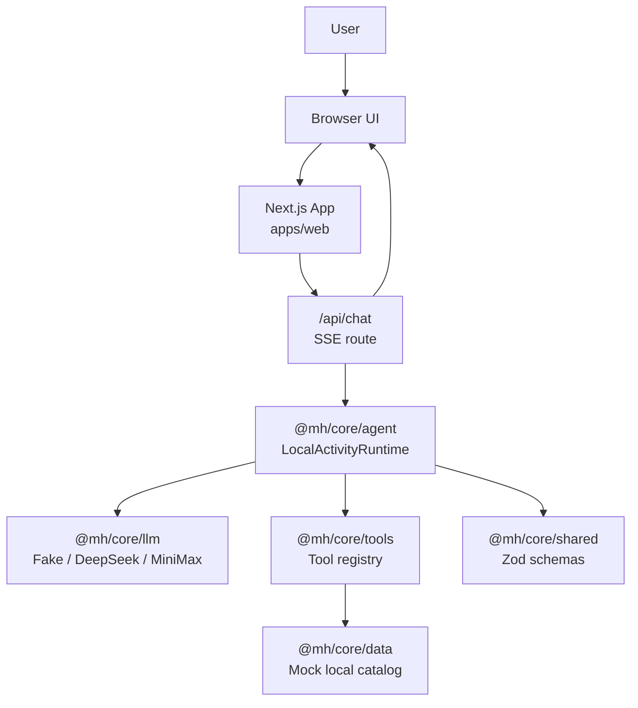
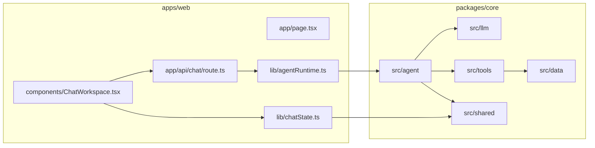
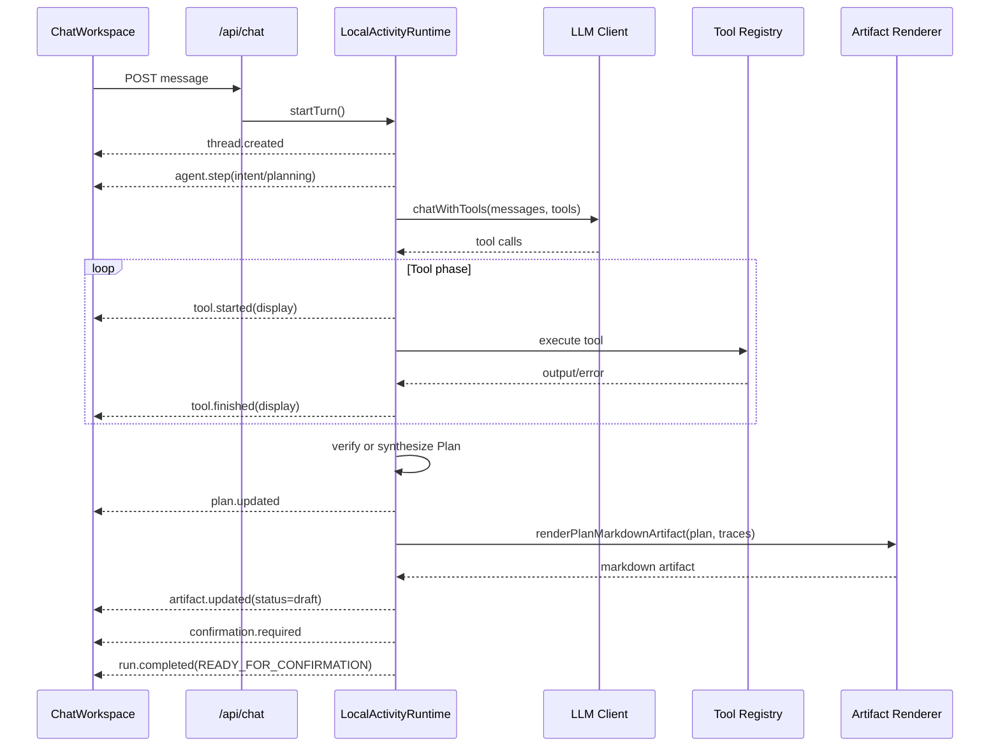
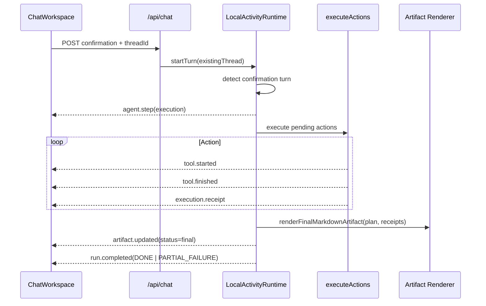
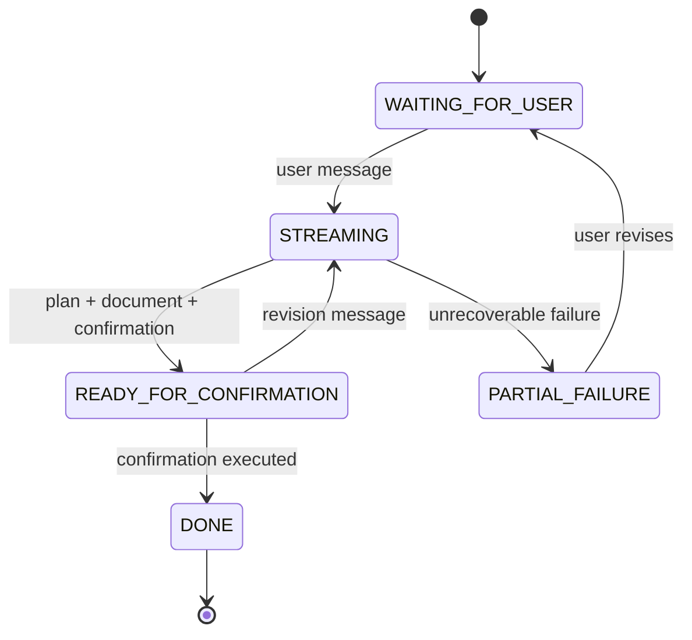
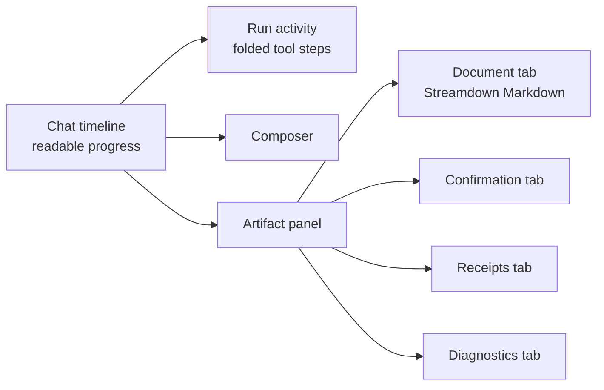
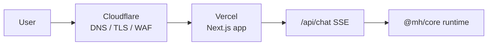

# Architecture

This document captures the current architecture of the LocalActivity Meituan Agent so future human and AI developers can extend the system without re-discovering the shape of the codebase.

## System Context



## Monorepo Boundaries



`packages/core` exposes subpaths:

```json
{
  "./agent": "./src/agent/index.ts",
  "./llm": "./src/llm/index.ts",
  "./tools": "./src/tools/index.ts",
  "./data": "./src/data/index.ts",
  "./shared": "./src/shared/index.ts"
}
```

Keep runtime-neutral contracts in `shared`, not in `apps/web`.

## Planning and Artifact Flow



The important design choice: the user-facing Markdown document is rendered after the tool/data phase, not by showing raw tool JSON in the chat.

## Confirmation and Execution Flow



## Event Contract

All stream events are validated by `AgentStreamEventSchema`.

Display metadata is the UI-facing layer:

```ts
type AgentEventDisplay = {
  title: string;
  summary?: string;
  items?: { label: string; value: string; status?: string }[];
  severity?: "info" | "success" | "warning" | "error";
  artifactRef?: "document" | "plan" | "confirmation" | "receipts" | "diagnostics";
};
```

Raw `inputSummary` and `outputSummary` are retained for debugging/export, but normal UI should prefer `display`.

## Agent State Model



Thread state is currently in memory:

- messages
- events
- toolTraces
- plan
- artifacts
- pendingConfirmation
- receipts
- error/status

If persistence is added later, preserve this shape first and swap `ThreadStore` / `RunManager` implementations.

## ReAct Convergence

The ReAct node lives in `packages/core/src/agent/nodes/runReActPlanning.ts`.

Current guardrails:

- Duplicate or excessive tool calls are skipped with `tool.finished.status = "skipped"`.
- Execution tools are not available during planning.
- Recoverable tool failures are fed back as observations.
- If the model keeps repairing or calling tools after enough facts exist, runtime synthesizes a normal plan from successful traces.
- Loop-limit fallback produces a partial plan only when facts are incomplete.

This mirrors the DeerFlow lesson: tool execution and artifact/report generation are separate phases. Do not let the model wander forever when the runtime already has enough evidence to produce a usable artifact.

## UI Information Architecture



Desktop layout:

- chat workspace on the left
- artifact panel on the right
- document tab opens automatically on `artifact.updated`

Mobile layout:

- artifact panel stacks below chat
- composer remains usable and should not cover document content

## Deployment Shape

Recommended first deployment:



Initial deployment should keep the runtime inside Vercel. Cloudflare should handle domain, DNS, SSL/TLS, WAF, and cache bypass rules for SSE/API paths.

Future extension options:

- Cloudflare R2 for file-backed Markdown artifacts.
- Cloudflare D1 or a hosted Postgres for thread/run persistence.
- Cloudflare Workers/Queues for long-running jobs.
- Vercel Blob/Postgres if staying fully in the Vercel ecosystem.

## Extension Points

Add a new planning tool:

1. Add data model if needed in `packages/core/src/data`.
2. Add tool in `packages/core/src/tools/mock` or a new provider folder.
3. Register it in `packages/core/src/tools/index.ts`.
4. Add display summary in `packages/core/src/agent/display.ts`.
5. Add tests in `packages/core/src/tools/__tests__` and agent flow tests if the tool affects planning.

Add a new stream event:

1. Extend `AgentStreamEventSchema` in `packages/core/src/shared`.
2. Emit in agent runtime.
3. Fold into client state in `apps/web/lib/chatState.ts`.
4. Render in `ChatWorkspace`.
5. Add shared schema and UI state tests.

Add durable storage:

1. Keep `ThreadStore`, `RunManager`, and `StreamBridge` interfaces stable.
2. Implement new adapters.
3. Keep terminal event ordering tests.
4. Decide artifact store semantics before changing `AgentArtifact`.

## Test Map

- Shared event schema: `packages/core/src/shared/__tests__`
- LLM config/providers: `packages/core/src/llm/__tests__`
- Tool registry: `packages/core/src/tools/__tests__`
- Runtime and ReAct behavior: `packages/core/src/agent/__tests__`
- Frontend event folding: `apps/web/lib/chatState.test.ts`
- API SSE behavior: `apps/web/app/api/chat/route.test.ts`

Run before handing off:

```bash
pnpm test
pnpm typecheck
pnpm check
```
